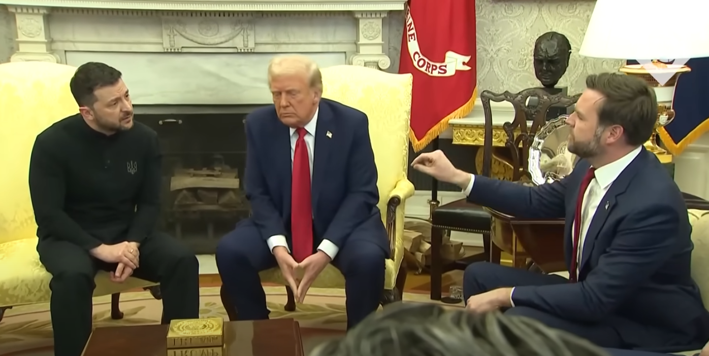

When people from different cultures interact, misunderstanding may occur. I think one cause of this arises from the increased difficulty of empathizing with (or putting yourself in the shoes of) someone raised in a different cultural environment. Another cause, which I would like to shed some light on in this post, are variations in societal norms. The example I want to analyze here is saying "thank you".

On spring break (or "the vac" as it is called at Oxford), I traveled to Morocco. I flew into Marrakesh, met up with my American friend on a Fulbright, and we trained to Casablanca to stay with a friend I had made through competing at hackathons together. My Moroccan friend's dad picked us up from the train station and gave us a tour of the city. Then - it was Ramadan so everyone was fasting - we broke fast with them and ate from an incredible spread of dishes. They offered us food and all we could say was "thank you" so many times it began to feel awkward. We were also the center of attention of the entire household which contributed to my unease.

During my receipt of a mind-boggling amount of hospitality (really - it was on another level), I continually expressed my gratitude "thank you", "thanks, this is amazing". But then, the father said "stop saying thank you, no need". And I realized that our expressions of gratitude were making *them* uncomfortable - just as my receipt of their incredible hospitality was making *me* uncomfortable.

By this point of Iftar (the meal at sunset which breaks the day's fast), we were running out of conversation topics so I proffered this to the table. In the states, my mom harped on us to always say thank you. But in the situation I found myself in, I was being told *not* to say thank you. Is this a cultural difference? Do people not say thank you in Morocco? People do say thank you in Morocco - "choukran", but as a guest it seemed to be bad form to repeatedly thank them as we received each new dish / present / experience they graced us with. We laughed at this cultural difference and took cracks at explaining it. Could it be a reflection of America's transactional culture? To accept something without the token expression, in the states, is to appear rude. Perhaps it satisfies the roleplay of the two-party transaction, signifying that you played a role - the receiver-receipiant transaction was not totally one-sided (a scary propsect - receiving without giving back???).

We had happened upon a difference in cultural norms. Then I remembered one salient example of saying vs not saying thank you on a world stage: the disastrous [Zelensky - Trump meeting](https://youtu.be/v_kTNIYsFnQ?t=230). Is the Ukranian social norm of saying thank you subtly different from the American one? Could an awareness of this have prevented the diplomatic tragedy of February 28, 2025?

There is no "correct" culture, but for Zelensky to achieve his goals adopting the American thank you culture would have benefited him. And for my goal of pleasing our hosts, refraining from repeatedly thanking them would have benefitted me. However, we both may have found the frictions of breaking from old habits insurmoutable. I find probing differences like these to be fascinating as they also reveal glimpses of other cultures' worldviews (accepting without feeling any obligation to repay).